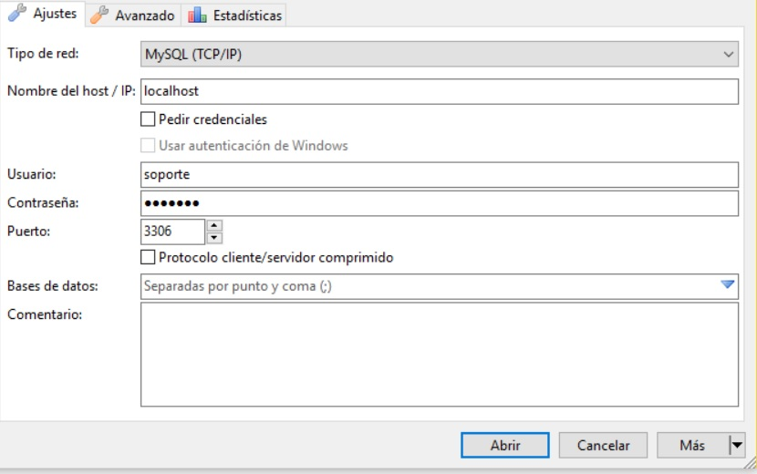
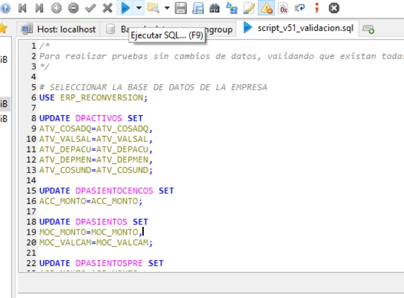

# reconversion_vzla2018
Varios Script y Programas para La Reconversion en Venezuela

## PARA USO GENERAL

### script_v51_validacion.sql
01) Ejecutar gestor de interface de base de datos SQL (HeidiSQL, SqlFront, Navicat, Etc.)

  
  
  

  

  

  
</p

(si el proceso de validacion falla en algun campo, no debe ejecutar el siguiente script) 

### script_v51_empresa.sql
01) Ejecutar gestor de interface de base de datos SQL (HeidiSQL, SqlFront, Navicat, Etc.)
02) Identificar la base de datos de la empresa: Ejm. 'apbase' - 'dpadmwin' - 'dpsgev51' - 'suempresa' - 'erp_miempresa'
03) Realizar respaldo de la base de datos: *identifique correctamente su empresa*
04) Abrir o Cargar el archivo *script_v51_empresa.sql* con el gestor de base de datos
05) Desde la ventana de consulta, identificar y reemplazar el nombre de *'ERP_RECONVERSION'* por el de su base de datos 
06) Ejecutar el proceso solo '1 vez', *Se dividiran todos los campos con contenido monetario*  

### script_v51_baseconfig.sql
01) Ejecutar gestor de interface de base de datos SQL (HeidiSQL, SqlFront, Navicat, Etc.)
02) Identificar la base de datos de la empresa: Ejm. 'apconfig' - 'admconfig' - 'dpconfig51' - 'suconfig'
03) Realizar respaldo de la base de datos: *identifique correctamente sus datos de configuracion*
04) Abrir o Cargar el archivo *script_v51_baseconfig.sql* con el gestor de base de datos
05) Desde la ventana de consulta, identificar y reemplazar el nombre de *'SUCONFIG'* por el de su base de datos 
06) Ejecutar el proceso, *Esto eliminara campos historicos de auditoria* 

## PARA USO DE DATOS PERSONALIZADOS DE INDUSTRIAS BRAVOS
*Los siguientes script estan personalizados para una empresa en particular NO deben ser ejecutados en particulares*

### script_v50_nomina.sql

### script_v50_bravocia.sql